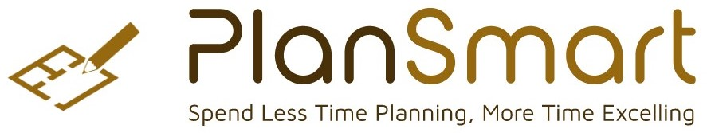
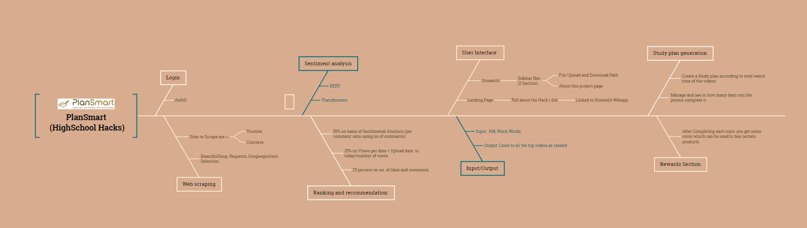

# plansmart

## 💡Inspiration
As the sole developer working on PlanSmart, I sought inspiration from my younger brother and sister, who are currently in high school. I wanted to address a common and significant problem faced by students of all ages: the challenge of finding good study materials. Amongst the various obstacles, the most time-consuming task is researching and determining the best courses to take for a particular field of study. It was this issue that motivated me to create PlanSmart.

## ⚙ What it does
PlanSmart is an innovative platform designed to alleviate one of the biggest challenges faced by students: finding the best study materials. The goal of PlanSmart is to streamline the process of selecting courses and materials, saving students valuable time and effort in their educational journey.

The core functionality of PlanSmart revolves around the intelligent recommendation of videos based on a given syllabus. By leveraging web scraping techniques, PlanSmart gathers data from popular platforms such as YouTube, Coursera, and other online learning platforms. The platform then utilizes sentiment analysis to evaluate the content of these videos, assessing factors such as the quality of explanations, relevance to the topic, and overall user sentiment. This analysis helps to identify the best video resources for each topic within the syllabus.

To further enhance the user experience, PlanSmart incorporates a ranking and recommendation system. Videos are assigned scores based on various factors, including sentimental analysis results, the number of views per day, and the number of likes and comments. These scores are then used to create an index ranging from 1 to 10, with the video with the highest score being ranked as the best option. This ranking system ensures that students are provided with the highest-quality videos for each topic, empowering them to make informed decisions about their study materials.

## 🛠 Working
PlanSmart goes beyond simply recommending videos by offering a comprehensive study plan generation feature. The recommended videos are organized into a structured study plan, providing students with a clear roadmap to follow in their learning journey. This study plan takes into account the duration and complexity of each video, allowing students to optimize their study schedule and ensure efficient progress through their syllabus.

In addition to the study plan and video recommendations, PlanSmart incorporates a coin-based reward system. Students earn coins by completing their syllabus or achieving certain milestones. These coins can be redeemed for various rewards within the platform, such as accessing additional features, exclusive content, or even discounts on educational resources. The reward system aims to motivate and incentivize students, making the learning process more engaging and enjoyable.

PlanSmart also places a strong emphasis on user experience and accessibility. The platform features a user-friendly and intuitive interface developed using Streamlit, enabling students to easily navigate through the site and access the recommended resources. Integration with authentication services, such as Auth0, ensures secure user logins and protects personal information.

## Future Aspects

Looking towards the future, PlanSmart has ambitious plans for expansion. This includes incorporating support for additional learning platforms, such as Udemy and Skillshare, to provide a broader range of study materials for students. The platform will continue to evolve, integrating new features and functionalities to cater to the diverse needs of students across various educational levels and subjects.

## 📌 Summary
In summary, PlanSmart aims to revolutionize the way students discover and access study materials by leveraging sentiment analysis, ranking and recommendation algorithms, and a user-friendly interface. With its comprehensive study plan generation, coin-based reward system, and focus on user experience, PlanSmart is poised to empower students in their educational pursuits, helping them save time, make informed decisions, and achieve academic excellence.

## My Workflow

